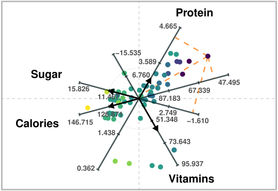

<!-- README.md is generated from README.Rmd. Please edit that file -->

# aramappings 

<!-- badges: start -->

[](https://github.com/manuelrubio/aramappings/actions/workflows/R-CMD-check.yaml)
<!-- badges: end -->

The goal of aramappings is to compute dimensionality reduction mappings
associated with Adaptable Radial Axes (ARA) plots (Rubio-Sánchez,
Sanchez, and Lehmann 2017).

ARA is a type of “radial axes” multivariate visualization technique.
Other prominent examples include star coordinates (SC) (Kandogan 2000,
2001) and biplots (Gabriel 1971; Gower and Hand 1995; Hofmann 2004;
Grange, Roux, and Gardner-Lubbe 2009; Greenacre 2010), which have been
used mainly for exploratory purposes, including cluster analysis,
outlier and trend detection, decision support tasks. Their main appeal
is the possibility to simultaneously display information about both data
observations and variables. In particular, high-dimensional numerical
data observations are represented as points (or other visual markers) on
a two- or three-dimensional space, while data variables are represented
through axis vectors, and optionally line axes, similar to those in a
Cartesian coordinate system.

With ARA, users create desired visualization by specifying a set of axis
vectors interactively (as in SC), where each vector is associated with a
data variable. These axis vectors indicate the directions in which the
values of their associated variables increase within the plot.
Additionally, the high-dimensional observations are mapped (in an
optimal sense) onto the plot in order to allow users to estimate
variable values by visually projecting these points onto the labeled
axes, as in Biplots.

<div class="figure" style="text-align: center">


<p class="caption">

ARA plot of four variables of a breakfast cereal dataset.
High-dimensional data values can be estimated via projections onto the
labeled axes, as in Biplots.
</p>

</div>

The previous figure is an ARA plot of a breakfast cereal dataset. The
axis vectors associated with the variables are chosen to distinguish
between healthier cereals (toward the right) and less healthy ones
(toward the left). For instance, points on the right will generally have
larger values of Protein and Vitamins, and lower values of Sugar and
Calories. Users can obtain approximations of data values by visually
projecting the plotted points onto the labeled axes. For example, users
would estimate a value of about 57 calories for the point that lies
further to the right.

## Overview

<!-- main components of the package. For more complex packages, this will point to vignettes for more details. -->

There are nine types of ARA plots (see the **vignette** for details).
Thus, **aramappings** provides nine functions to generate each ARA
mapping:

- `ara_unconstrained_L2()`
- `ara_unconstrained_L1()`
- `ara_unconstrained_Linf()`
- `ara_exact_L2()`
- `ara_exact_L1()`
- `ara_exact_Linf()`
- `ara_ordered_L2()`
- `ara_ordered_L1()`
- `ara_ordered_Linf()`

Each function is included in a different source file. In addition, the
previous functions calculate the two- or three-dimensional coordinates
of the data observations in the visualization space by solving convex
optimization problems. The source files include additional functions for
selecting among several optimization solvers. The functions in the nine
ARA files also rely on auxiliary methods included in file
<tt>utils.R</tt>.

The main goal of the package is to provide functionality for generating
the mappings, but not to create visualizations. Nevertheless, it
includes a method for generating a two-dimensional plot for standardized
data:

- `draw_ara_plot_2d_standardized()`

## Installation

Install a stable version from CRAN

``` r
install.packages("aramappings")
#> Installing package into 'C:/Users/manue/AppData/Local/Temp/RtmpMZU3kz/temp_libpath4c01e751897'
#> (as 'lib' is unspecified)
#> Warning: package 'aramappings' is not available for this version of R
#> 
#> A version of this package for your version of R might be available elsewhere,
#> see the ideas at
#> https://cran.r-project.org/doc/manuals/r-patched/R-admin.html#Installing-packages
```

Install the development version of aramappings from
[GitHub](https://github.com/) with:

``` r
# install.packages("devtools")
devtools::install_github("manuelrubio/aramappings", build_vignettes = TRUE)
#> Using GitHub PAT from the git credential store.
#> Downloading GitHub repo manuelrubio/aramappings@HEAD
#> 
#> ── R CMD build ─────────────────────────────────────────────────────────────────
#>          checking for file 'C:\Users\manue\AppData\Local\Temp\RtmpwJS955\remotes128870b01b96\manuelrubio-aramappings-8ad5bd3/DESCRIPTION' ...  ✔  checking for file 'C:\Users\manue\AppData\Local\Temp\RtmpwJS955\remotes128870b01b96\manuelrubio-aramappings-8ad5bd3/DESCRIPTION'
#>       ─  preparing 'aramappings':
#>    checking DESCRIPTION meta-information ...     checking DESCRIPTION meta-information ...   ✔  checking DESCRIPTION meta-information
#>       ─  installing the package to build vignettes
#>          creating vignettes ...     creating vignettes ...   ✔  creating vignettes (8.4s)
#>       ─  checking for LF line-endings in source and make files and shell scripts (572ms)
#>       ─  checking for empty or unneeded directories
#>       ─  building 'aramappings_0.1.0.tar.gz' (370ms)
#>      
#> 
#> Installing package into 'C:/Users/manue/AppData/Local/Temp/RtmpMZU3kz/temp_libpath4c01e751897'
#> (as 'lib' is unspecified)
```

<!--- ```{r install_dev}
# install.packages("pak")
pak::pak("manuelrubio/aramappings")
``` -->

## Example

We recommend starting an exploratory analysis using an unconstrained ARA
plot with the $\ell^{2}$ norm, which can be generated very efficiently
since the mappings can be obtained through a closed-form expression
(i.e., a formula). The obvious first step is to load the **aramappings**
package:

``` r
# Load package
library(aramappings)
```

In the usage examples we will use the **Auto MPG** dataset available in
packages **ascentTraining** and **grpnet**, Kaggle, or the UCI Machine
Learning Repository (Frank and Asuncion 2010). In this case, we load the
dataset in the **ascentTraining** package.

``` r
# Load data
library(ascentTraining) # contains the Auto MPG dataset
data("auto_mpg")
```

Next, we select a subset of numerical variables from the dataset. The
selected variables are specified through a vector containing their
column indices in the original dataset. Furthermore, we rename the data
set to `X`, simply for clarity with respect to the notation defined
above.

``` r
# Define subset of (numerical) variables
selected_variables <- c(1,4,5,6)   # 1:"mpg", 4:"horsepower", 5:"weight", 6:"acceleration")

# Retain only selected variables and rename dataset as X
X <- auto_mpg[, selected_variables] # Select a subset of variables
rm(auto_mpg)
#> Warning in rm(auto_mpg): objeto 'auto_mpg' no encontrado
```

The ARA functions halt if the data or other parameters contain missing
values. Thus, we proceed eliminating any row (data observation) that
contains missing values. Naturally, another approach consists of
replacing missing values by some other substituted values (imputation).

``` r
# Remove rows with missing values from X
N <- nrow(X)
rows_to_delete <- NULL
for (i in 1:N) {
  if (sum(is.na(X[i, ])) > 0) {
    rows_to_delete <- c(rows_to_delete, -i)
  }
}
X <- X[rows_to_delete, ]
```

At this moment `X` is a <tt>data.frame</tt>. In order to use the ARA
functions we first need to convert it to a matrix:

``` r
# Convert X to matrix
X <- apply(as.matrix.noquote(X), 2, as.numeric)
```

In addition, we strongly recommend standardizing the data when using
ARA. We save the result in variable `Z` since the function that draws
the plot needs the original values in `X`.

``` r
# Standardize data
Z <- scale(X)
```

Having preprocessed the data, the next step consists of defining the
axis vectors, which are the rows of $\mathbf{V}$. These can be obtained
manually (ideally through a graphical user interface), or through an
automatic method. For instante, $\mathbf{V}$ could be the matrix
defining the Principal Component Analysis transfomation (in that case
the ARA plot would be a Principal Component Biplot). In this example, we
simply define a configuration of vectors in polar coordinates and
transform them to Cartesian coordinates with the `pol2cart()` function
in package **geometry**.

``` r
# Define axis vectors (2-dimensional in this example)
library(geometry)
r <- c(0.8, 1, 1.2, 1)
theta <- c(225, 100, 315, 80) * 2 * pi / 360
V <- pol2cart(theta, r)
```

It is also possible to define weights in order to control the relative
importance of estimating accurately on each axis. This is nevertheless
complex, since the accuracy also depends on the length of the axis
vectors. In this case, we have set two weigths to 1 and another two to
0.75. Visually, the weights determine the level of gray used to color
the axis vectors in the ARA plot.

``` r
# Define weights
weights <- c(1, 0.75, 0.75, 1)
```

Having defined the data (`Z`), axis vectors (`V`), and weights
(`weights`), we can proceed to compute the ARA mapping. For
unconstrained ARA plots with the $\ell^{2}$ norm the `solver` parameter
should be set to “formula” (the default), in order to obtain the mapping
through a closed-form expression. The following code computes the
embedded points and saves them in `mapping$P`, and shows the execution
runtime involved in computing the mapping.

``` r
# Compute the mapping and print the execution time
start <- Sys.time()
mapping <- ara_unconstrained_L2(
  Z,
  V,
  weights = weights,
  solver = "formula"
)
end <- Sys.time()
print(end - start, units = "secs")
#> Time difference of 0.01035404 secs
```

ARA plots can get cluttered when showing all of the axis lines and
corresponding labels at the tick marks. Thus, the function that we will
use to draw the ARA plot (`draw_ara_plot_2d_standardized()`) contains a
parameter called `axis_lines` for specifying the subset of axis lines
(and labels) we wish to visualize. In this example we will show the axes
associated with variables “mpg” and “acceleration”. Note that in the
original data frame these were variables 1 and 6. However, since we only
retained four variables (“mpg”, “horsepower”, “weight”, and
“acceleration”), the column index of “acceleration” is now 4.

``` r
# Select variables with labeled axis lines on ARA plot
axis_lines <- c(1,4)   # 1:"mpg", 4:"acceleration")
```

Also, the plotted points can be colored according to the values of a
particular variable. In this example, we will color the points according
to the value of variable “mpg”.

``` r
# Select variable used for coloring embedded points
color_variable <- 1    # "mpg"
```

Finally, we generate the ARA plot by calling
`draw_ara_plot_2d_standardized()`:

``` r
# Draw the ARA plot
draw_ara_plot_2d_standardized(
  Z,
  X,
  V,
  mapping$P,
  weights = weights,
  axis_lines = axis_lines,
  color_variable = color_variable
)
```

<div class="figure" style="text-align: center">


<p class="caption">

Unconstrained ARA plot with the L2 norm of a subset of the Autompg
dataset.
</p>

</div>

## References

<div id="refs" class="references csl-bib-body hanging-indent"
entry-spacing="0">

<div id="ref-Frank10" class="csl-entry">

Frank, A., and A. Asuncion. 2010. “UCI Machine Learning Repository.”
University of California, Irvine, School of Information; Computer
Sciences. [archive.ics.uci.edu/ml](https://archive.ics.uci.edu/ml).

</div>

<div id="ref-Gabriel71" class="csl-entry">

Gabriel, K. R. 1971. “The Biplot Graphic Display of Matrices with
Application to Principal Component Analysis.” *Biometrika* 58 (3):
453–67. <https://doi.org/10.1093/biomet/58.3.453>.

</div>

<div id="ref-Gower95" class="csl-entry">

Gower, John C., and David J. Hand. 1995. *Biplots*. Chapman & Hall/CRC
Monographs on Statistics & Applied Probability. Taylor & Francis.
[https://doi.org/10.1002/(SICI)1097-0258(20000130)19:2\<278::AID-SIM332\>3.0.CO;2-3](https://doi.org/10.1002/(SICI)1097-0258(20000130)19:2<278::AID-SIM332>3.0.CO;2-3).

</div>

<div id="ref-laGrange09" class="csl-entry">

Grange, Anthony la, Niël le Roux, and Sugnet Gardner-Lubbe. 2009.
“BiplotGUI: Interactive Biplots in r.” *Journal of Statistical Software*
30 (12): 1–37. <https://doi.org/10.18637/jss.v030.i12>.

</div>

<div id="ref-Greenacre10" class="csl-entry">

Greenacre, Michael. 2010. *Biplots in Practice*. BBVA Foundation.

</div>

<div id="ref-Hofmann04" class="csl-entry">

Hofmann, Heike. 2004. “COMPSTAT 2004 — Proceedings in Computational
Statistics: 16th Symposium Held in Prague, Czech Republic, 2004.” In,
223–34. Heidelberg: Physica-Verlag HD.
<https://doi.org/10.1007/978-3-7908-2656-2_18>.

</div>

<div id="ref-Kandogan00" class="csl-entry">

Kandogan, Eser. 2000. “Star Coordinates: A Multi-Dimensional
Visualization Technique with Uniform Treatment of Dimensions.” In
*Proceedings of the IEEE Information Visualization Symposium, Late
Breaking Hot Topics*, 9–12.

</div>

<div id="ref-Kandogan01" class="csl-entry">

———. 2001. “Visualizing Multi-Dimensional Clusters, Trends, and Outliers
Using Star Coordinates.” In *Proceedings of the Seventh ACM SIGKDD
International Conference on Knowledge Discovery and Data Mining*,
107–16. KDD’01. New York, NY, USA: ACM.
<https://doi.org/10.1145/502512.502530>.

</div>

<div id="ref-Rubio17" class="csl-entry">

Rubio-Sánchez, Manuel, Alberto Sanchez, and Dirk J. Lehmann. 2017.
“Adaptable Radial Axes Plots for Improved Multivariate Data
Visualization.” *Computer Graphics Forum* 36 (3): 389–99.
<https://doi.org/10.1111/cgf.13196>.

</div>

</div>
